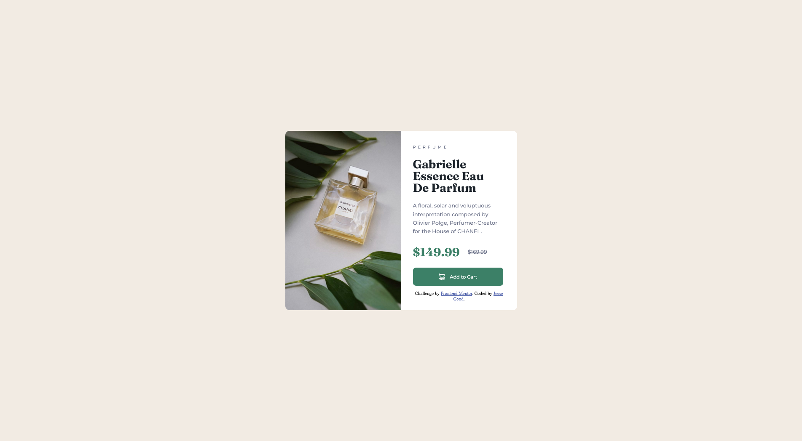

# Frontend Mentor - Product preview card component solution

This is a solution to the [Product preview card component challenge on Frontend Mentor](https://www.frontendmentor.io/challenges/product-preview-card-component-GO7UmttRfa). Frontend Mentor challenges help you improve your coding skills by building realistic projects.

## Table of contents

- [Overview](#overview)
  - [The challenge](#the-challenge)
  - [Screenshot](#screenshot)
  - [Links](#links)
- [My process](#my-process)
  - [What I learned](#what-i-learned)

## Overview

### The challenge

Users should be able to:

- View the optimal layout depending on their device's screen size
- See hover and focus states for interactive elements

### Screenshot

### Links

- Solution URL: [Solution](https://your-solution-url.com)
- Live Site URL: [Live site](https://product-preview-card-component-main-mauve.vercel.app/)

## My process

### What I learned

When you have padding on chidren getting equal columns with flexbox is impossible from what I understand. To work around it you have to wrap the element with padding on it in another element such as a `
`.
[This article](https://css-tricks.com/equal-columns-with-flexbox-its-more-complicated-than-you-might-think/) goes into detail about this.
